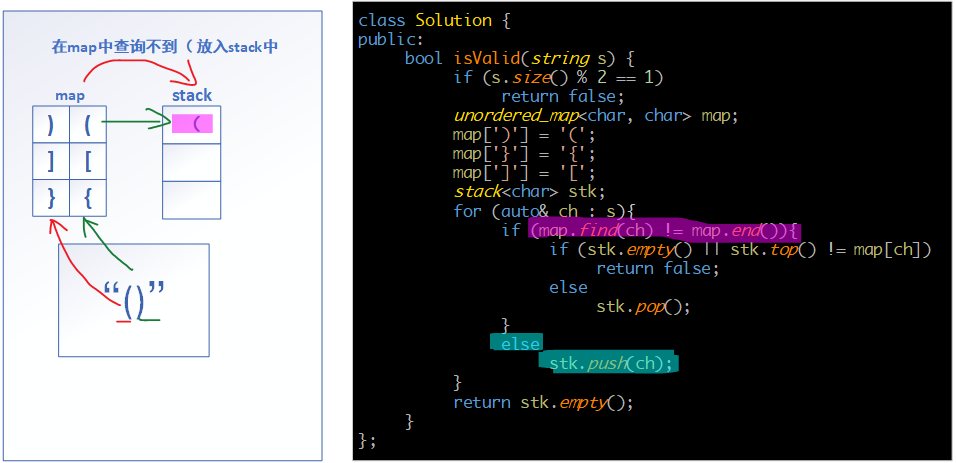

```给定一个只包括 '('，')'，'{'，'}'，'['，']' 的字符串，判断字符串是否有效。

有效字符串需满足：

左括号必须用相同类型的右括号闭合。
左括号必须以正确的顺序闭合。
注意空字符串可被认为是有效字符串。

示例 1:

输入: "()"
输出: true
示例 2:

输入: "()[]{}"
输出: true
示例 3:

输入: "(]"
输出: false
示例 4:

输入: "([)]"
输出: false
示例 5:

输入: "{[]}"
输出: true

来源：力扣（LeetCode）
链接：https://leetcode-cn.com/problems/valid-parentheses
著作权归领扣网络所有。商业转载请联系官方授权，非商业转载请注明出处。```
