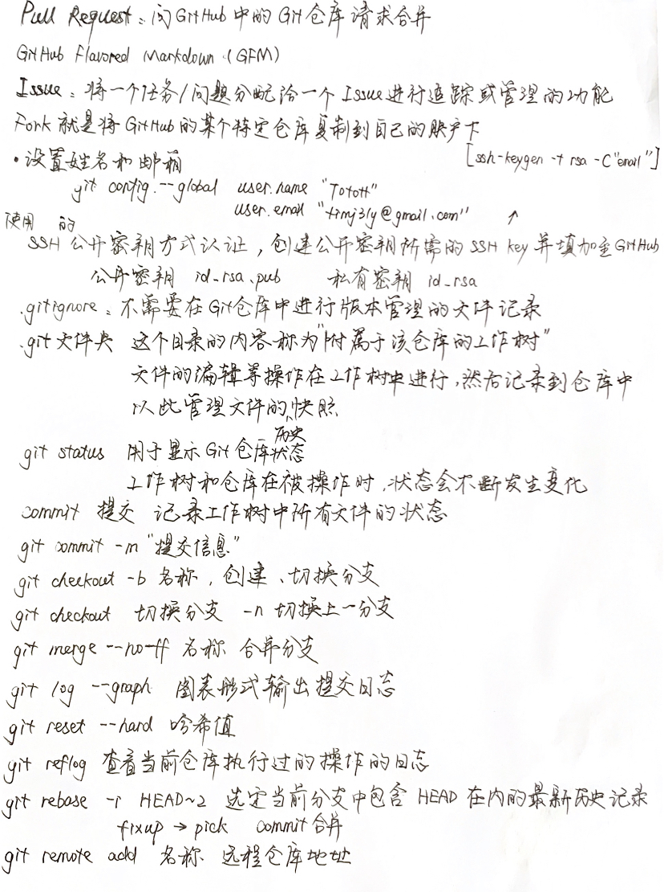

<!-- TOC -->

- [0.1. Git push](#01-git-push)
  - [0.1.1. 推送至master 分支](#011-推送至master-分支)
  - [0.1.2. 推送至master 以外的分支](#012-推送至master-以外的分支)
- [0.2. 其他常用命令](#02-其他常用命令)
- [0.3. Git add . 与撤销](#03-git-add--与撤销)

<!-- /TOC -->
## 0.1. Git push

### 0.1.1. 推送至master 分支
如果想将当前分支下本地仓库中的内容推送给远程仓库，需要用到`git push`命令。现在假定我们在master 分支下进行操作。

```
$ git push -u origin master
Counting objects: 20, done.
Delta compression using up to 8 threads.
Compressing objects: 100% (10/10), done.
Writing objects: 100% (20/20), 1.60 KiB, done.
Total 20 (delta 3), reused 0 (delta 0)
To git@github.com:github-book/git-tutorial.git
* [new branch] master -> master
Branch master set up to track remote branch master from origin.
```

像这样执行git push命令，当前分支的内容就会被推送给远程仓库 origin 的master 分支。
`-u`参数可以在推送的同时，将 origin 仓库的master 分支设置为本地仓库当前分支的`upstream`（上游）。添加了这个参数，将来运行git pull命令从远程仓库获取内容时，本地仓库的这个分支就可以直接从 origin 的 master 分支获取内容，省去了另外添加参数的麻烦。
执行该操作后，当前本地仓库master 分支的内容将会被推送到 GitHub 的远程仓库中。在 GitHub 上也可以确认远程 master 分支的内容和本地 master 分支相同。

### 0.1.2. 推送至master 以外的分支

除了master 分支之外，远程仓库也可以创建其他分支。举个例子，我
们在本地仓库中创建feature-D 分支，并将它以同名形式push 至远程仓库。

```
$ git checkout -b feature-D
Switched to a new branch 'feature-D'
```

我们在本地仓库中创建了feature-D 分支，现在将它push 给远程仓
库并保持分支名称不变。

```
$ git push -u origin feature-D
Total 0 (delta 0), reused 0 (delta 0)
To git@github.com:github-book/git-tutorial.git
* [new branch] feature-D -> feature-D
Branch feature-D set up to track remote branch feature-D from origin.
```

现在，在远程仓库的GitHub 页面就可以查看到feature-D 分支了。


## 0.2. 其他常用命令



## 0.3. Git add . 与撤销

比如修改了 a.txt b.txt c.txt d.txt，在 git add 的时候，想 add a,b,c 三个文件，但是想临时忽略（即不提交 d.txt）的修改

```git
git add .
//完成添加所有修改项

git reset -- 文件名
//撤销“文件名”的add

git commit -m "Test"

git push
```

git 同步 T0k3n
```
41d9005e121b767e41b02326f862c32b275ebcf2
```