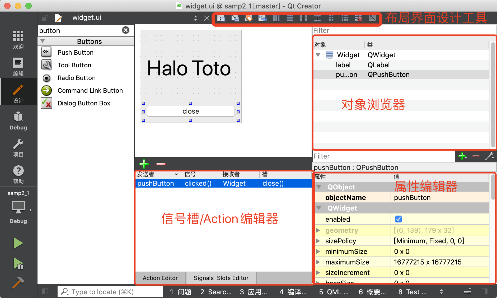

   * [2.1 UI文件设计与运行机制](#21-ui文件设计与运行机制)
      * [2.1.1 项目文件组成](#211-项目文件组成)
      * [2.1.2 项目管理文件](#212-项目管理文件)
      * [2.1.3 界面文件](#213-界面文件)
      * [2.1.4 主函数文件](#214-主函数文件)
      * [2.1.5 窗体相关的文件](#215-窗体相关的文件)

# 2.1 UI文件设计与运行机制
## 2.1.1 项目文件组成
文件类型|文件名称|文件作用
---|---|---
项目组织文件|samp2_1.pro|储存项目
主程序入口文件|main.cpp|实现main()函数的程序文件
窗体界面文件|widget.ui|一个XML格式储存的窗体上的元件及其布局的文件
头文件|widget.h|是源文件定义类的实现文件
## 2.1.2 项目管理文件
代码段|功能
---|---
Qt+=core gui|表示项目中加入core gui模块。core gui是Qt用于GUI设计的类库模块，如果创建的是控制台(Console)应用程序，就不需要添加core gui
greaterThan(Qt_MAJOR_VERSION,4):Qt  += widgets|表示Qt主版本大于4时，才加入widgets模块
TAEGET = samp2_1|表示生成的目标可执行文件的名称，即编译后的可执行文件是`samp2_1.exe`
TEMPLATE = app|表示项目使用的模版是app，是一般的应用程序
- Qt类库以模块的形式组织各种功能的类，根据项目涉及的功能需求，在项目中添加适当的类库模块支持。例如，如果项目中使用到了涉及数据库操作的类就需要用到sql模块，在pro文件中需要增加如下一行：
`Qt  +=sql`
- 后面的SOURCES、HEADERS、FORMS记录了项目中包含的源程序文件、头文件和窗体文件(.ui文件)的名称。这些文件列表是Qt Creator自动添加到项目管理文件里面的，用户不需要手动修改。当添加一个文件到项目，或从项目里删除一个文件时，项目管理文件里的条目会自动修改。
## 2.1.3 界面文件
后缀为.ui的文件是可视化窗体的定义文件，如widget.ui。双击项目文件目录树中的文件widget.ui，会打开一个集成在Qt Creator中的Qt Designer对窗体进行可视化设计。

- 布局和界面设计工具栏。窗口上方的一个工具栏，工具栏上的按钮主要实现布局和界面设计；
- 对象浏览器(Object Inspector).窗口右上方是Object Inspector，用树状视图显示窗体上各个组件之间的布局包含关系，显示每个组件的对象名称和类名称；
- 属性编辑器（Property Editor）。窗口右下方是属性编辑器，是界面设计时最常用到的编辑器。属性编辑器显示某个选中的组件或窗体的各种属性及其取值，可以在属性编辑器里修改这些属性的值。
## 2.1.4 主函数文件
```c++
#include "widget.h"

#include <QApplication>

int main(int argc, char *argv[])
{
    QApplication a(argc, argv); //定义并创建应用程序
    Widget w;                   //定义并创建窗体
    w.show();                   //显示窗体
    return a.exec();            //应用程序运行
}
```
名称|作用
---|---
main()函数|创建应用程序，创建窗口，显示窗口，运行应用程序，开始应用程序的消息循环和事件处理
QApplication|是Qt的标准应用程序类，第一行代码定义了一个QApplication类的实例a，是应用程序对象
Widget|定义了一个Widget类的w，Widget是本实例设计的窗口的雷鸣，定义次窗口后再用w.show()显示此窗口
a.exec()|启动应用程序的执行，开始应用程序的消息循环和事件处理

## 2.1.5 窗体相关的文件
对项目进行编译后会生成一个文件ui_widget.h，对于这样一个窗体，就有了4个文件。
文件|功能
---|---
widget.h|定义窗体类的头文件，定义了类Widget
widget.cpp|Widget类的功能实现源程序文件
widget.ui|窗体界面文件，由UI设计器自动生成，储存了窗体上各个组件的属性设置和布局
ui_widget.h|编译后，根据窗体上的组件及其属性、信号与槽的关联等自动生成一个类的定义文件，类的名称是Ui_Widget

1. widget.h文件
```c++
#ifndef WIDGET_H
#define WIDGET_H

#include <QWidget>

QT_BEGIN_NAMESPACE
namespace Ui { class Widget; }  //一个命名空间Ui，包含了一个类Widget
QT_END_NAMESPACE

class Widget : public QWidget
{
    Q_OBJECT

public:
    Widget(QWidget *parent = nullptr);
    ~Widget();

private:
    Ui::Widget *ui;            //使用Ui::Widget定义的一个指针，名为ui
};
#endif // WIDGET_H
```
widget.h文件有几个重要的部分。
- namespace声名
代码中有如下:
```c++
namespace Ui{
    class Widget;
}
```
这是声名了一个名称为Ui的命名空间，包含了一个类Widget。但是这个类Widget并不是本文件里定义的类Widget，而是ui_widget.h文件里定义的类，用于描述界面组件的。这个声名相当于一个**外部类型声名**（具体要看完ui_widget.h文件内的解释之后才能搞明白)。
- widget类的定义
widget.h文件的主体部分是一个继承于QWidget的类Widget的定义，也就是本实例的窗体类。
在Widget类中使用宏Q_OBJECT，这是使用Qt的信号槽机制的类必须加入的一个宏
在public部分定义了Widget类的构造函数和析构函数。
在private部分有定义了一个指针。
`Ui::Widget *ui;`
这个指针是用前面声名的namespace Ui里的Widget类定义的，所以指针ui是指向可视化设计的界面，后面会看到要访问界面上的组件，都需要通过这个指针ui。
2. widget.cpp文件
widget.cpp文件是类Widget的实现代码，下面是widget.cpp文件的内容。
```c++
#include "widget.h"
#include "ui_widget.h"

Widget::Widget(QWidget *parent)
    : QWidget(parent)
    , ui(new Ui::Widget)
{
    ui->setupUi(this);
}

Widget::~Widget()
{
    delete ui;
}
```
注意到，在这个文件的包含文件部分自动加入了如下一行内容：
`#include "ui_widget.h"
这个就是Qt编译生成的于UI文件widget.ui对应的类定义文件。
目前只有构造函数和析构函数。其中构造函数头部是：
```c++
Widget::Widget(QWidget *parent):QWidget(parent),ui(new Ui:Widget)
```
其意义是：执行父类QWidget的构造函数，创建一个Ui::Widget类的对象ui。这个ui就是Widget的private部分定义的指针变量ui。这个ui就是Widget的private部分定义的指针变量ui。
构造函数里只有一行语句：
```c++
ui->setupUi(this)
```
它是执行了Ui::Widget类的setupUi()函数，这个函数实现窗口的生成与各种属性的设置，信号与槽的关联。
析构函数知识简单地删除用new创建的指针ui。
所以在ui_widget.h文件里又一个namespace名称为Ui，里面又一个类Widget适用于描述可视化设计的窗体，且与widget.h里定义的类同名。在Widget类里访问Ui::Widget类的成员变量或函数需要通过Widget类里的ui指针，如同构造函数里执行`ui->setupUi(this)`函数那样。
3. widget.ui文件
   widget.ui是窗体界面定义文件，是一个XML文件，定义了窗口上的所有组件的属性设置和布局、信号与槽函数的关联等。用UI设计器可视化设计的界面都由Qt自动解析，并以XML文件的形式保存下来。在设计界面时，只需要在UI设计器里可视化设计即可，而不用管widget.ui文件是怎么生成的。
```xml
<?xml version="1.0" encoding="UTF-8"?>
<ui version="4.0">
 <class>Widget</class>
 <widget class="QWidget" name="Widget">
  <property name="geometry">
   <rect>
    <x>0</x>
    <y>0</y>
    <width>191</width>
    <height>175</height>
   </rect>
  </property>
  <property name="windowTitle">
   <string>Widget</string>
  </property>
  <layout class="QVBoxLayout" name="verticalLayout">
   <item>
    <widget class="QLabel" name="label">
     <property name="font">
      <font>
       <pointsize>40</pointsize>
      </font>
     </property>
     <property name="text">
      <string>Halo Toto</string>
     </property>
    </widget>
   </item>
   <item>
    <widget class="QPushButton" name="pushButton">
     <property name="text">
      <string>close</string>
     </property>
    </widget>
   </item>
  </layout>
 </widget>
 <resources/>
 <connections>
  <connection>
   <sender>pushButton</sender>
   <signal>clicked()</signal>
   <receiver>Widget</receiver>
   <slot>close()</slot>
   <hints>
    <hint type="sourcelabel">
     <x>95</x>
     <y>154</y>
    </hint>
    <hint type="destinationlabel">
     <x>95</x>
     <y>87</y>
    </hint>
   </hints>
  </connection>
 </connections>
</ui>
```
4. ui_widget.h文件
   ui_widget.h是在对widget.ui文件编译后产生的一个文件，ui_widget.h会出现在编译后的目录下，或与widget.ui同目录(与项目的shadow build编译设置有关)
   代码如下：
```c++
   /********************************************************************************
** Form generated from reading UI file 'widget.ui'
**
** Created by: Qt User Interface Compiler version 5.14.2
**
** WARNING! All changes made in this file will be lost when recompiling UI file!
********************************************************************************/

#ifndef UI_WIDGET_H
#define UI_WIDGET_H

#include <QtCore/QVariant>
#include <QtWidgets/QApplication>
#include <QtWidgets/QLabel>
#include <QtWidgets/QPushButton>
#include <QtWidgets/QVBoxLayout>
#include <QtWidgets/QWidget>

QT_BEGIN_NAMESPACE

class Ui_Widget
{
public:
    QVBoxLayout *verticalLayout;
    QLabel *label;
    QPushButton *pushButton;

    void setupUi(QWidget *Widget)
    {
        if (Widget->objectName().isEmpty())
            Widget->setObjectName(QString::fromUtf8("Widget"));
        Widget->resize(191, 175);
        verticalLayout = new QVBoxLayout(Widget);
        verticalLayout->setObjectName(QString::fromUtf8("verticalLayout"));
        label = new QLabel(Widget);
        label->setObjectName(QString::fromUtf8("label"));
        QFont font;
        font.setPointSize(40);
        label->setFont(font);

        verticalLayout->addWidget(label);

        pushButton = new QPushButton(Widget);
        pushButton->setObjectName(QString::fromUtf8("pushButton"));

        verticalLayout->addWidget(pushButton);


        retranslateUi(Widget);
        QObject::connect(pushButton, SIGNAL(clicked()), Widget, SLOT(close()));

        QMetaObject::connectSlotsByName(Widget);
    } // setupUi

    void retranslateUi(QWidget *Widget)
    {
        Widget->setWindowTitle(QCoreApplication::translate("Widget", "Widget", nullptr));
        label->setText(QCoreApplication::translate("Widget", "Halo Toto", nullptr));
        pushButton->setText(QCoreApplication::translate("Widget", "close", nullptr));
    } // retranslateUi

};

namespace Ui {
    class Widget: public Ui_Widget {};
} // namespace Ui

QT_END_NAMESPACE
#endif // UI_WIDGET_H
```
查看ui_widget.h文件的内容，发现它主要做了以下的工作：
1. 定义了一个类Ui_Widget,用于封装可视化设计的界面。
2. 自动生成了界面各个组件的类成员变量定义。在public部分为界面上每个组件定义了一个指针变量，变量的名称就是设置的objectName。
3. 定义了setupUi()函数，这个函数用于创建各个界面组件，并设置其位置、大小、文字内容、字体等属性，设置信号与槽的关联。
   setupUi()调用了函数retranslateUi(Widget)，用来设置界面各个组件的文字内容属性，如标签的文字、按键的文字、窗体的标题等。将界面上的文字设置的内容独立出来作为一个函数retranslateUi()，在设计 **多语言界面**时会用到这个函数。
   setupUi()函数的第三部分是设置信号与槽函数的关联，本文件中有以下两行：
   ```c++
    QObject::connect(pushButton, SIGNAL(clicked()), Widget, SLOT(close()));

    QMetaObject::connectSlotsByName(Widget);
    ```
    第一行是调用connect()函数，将在UI设计器里设置的信号与槽的关联转换为语句。这里是将btnClose按键的clicked()信号与窗体Widget的close()槽函数关联起来。
    第二行是设置槽函数的**关联方式**，用于将UI设计器自动生成的组件信号的槽函数与组件信号相关联。
    所以，在Widget的构造函数里调用`ui->setupUi(this)`，就实现了窗体上组件的创建、属性设置、信号与槽的关联。
4. 定义namespace Ui，并定义一个从Ui_Widget继承的类Widget。
```c++
namespace Ui{
    class Widget:public Ui_Widget{};
}
```
> ui_widget.h文件里实现界面功能的类是Ui_Widget。再定义一个类Widget从Ui_Widget继承而来，并定义在namespace Ui里，这样Ui::Widget与widget.h里的类Widget同名，但是用namespace区分开来。所以，界面的Ui::Widget类与文件widget.h里定义的Widget类实际上是两个类，但是Qt的处理让用户感觉不到Ui::Widget类的存在，只需要知道在Widget类里用ui指针可以访问可视化设计的界面组件就可以了。
2020年7月16日13:50