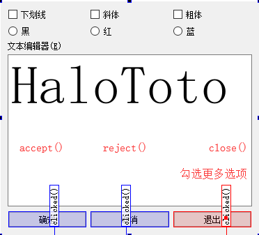

# 目录

# 可视化设计

在上一节通过一个简单的应用程序，**分析了Qt创建的GUI应用程序中各个文件的作用，剖析了可视化设计的UI文件是如何被转换为C++的类定义，并自动创建界面的**。这些是使用Qt Creator可视化设计用户界面，并使各个部分融合起来运行的基本原理。
本节再以一个稍微复杂的例子来讲解设计GUI的常见功能，包括**界面设计时的布局管理，程序里如何访问界面组件，以及Qt关键的信号与槽概念**。

## 实例程序功能

### 创建设置：

类型|名称
---|---
Application|samp2_2
基类|QDialog
生成类|QWDialog

### 组件设置：

对象名|类名|属性设置|备注
---|---|---|---
txtEdit|QPlainTextEdit|Text="HaloToto" Font.PointSize=20|用于显示文字内容，可编辑
chkBoxUnder|QCheckBox|Text="Underline"|设置字体为下划线
chkBoxItalic|QCheckBox|Text="Italic"|设置字体为斜体
chkBoxBold|QCheckBox|Text="Bold"|设置字体为粗体
rBtnBlack|QRadioButton|Text="Black"|字体颜色为黑色
rBtnRed|QRadioButton|Text="Red"|字体颜色为红色
rBtnBlue|QRadioButton|Text="Blue"|字体颜色为蓝色
btnOK|QPushButton|Text="确 定"|返回确定，并关闭窗口
btnCancel|QPushButton|Text="取 消"|返回取消，并关闭窗口
btnClose|QPushButton|Text="退 出"|退出程序
QWDialog|QWDialog|windowTitle="Dialog by Designer"|界面窗口的类名称是QWDialog，objectName不要修改
注意：

1. objectName是窗体上创建的组件的实例名称，界面上的每个组件需要有一个唯一的objectName，程序里访问界面组件时都是通过其objectName进行访问，自动生成的槽函数名称里也有objectName。所以，**组件的objectName需要在程序设计之前设计好**，设置好之后一般不需要再改动。
2. 窗体的objectName就是窗体的类名称，在UI设计器里不要修改窗体的objectName，**窗体的实例名称需要在使用窗体的代码里去定义。** //question

ui设计器工具栏各按钮的功能：
按钮及快捷键|功能
---|---
Edit Widget(F3)|界面设计进入编辑状态
Edit Signals/Slots(F4)|进入信号与槽的可视化设计状态
Edit Buddies|进入伙伴关系编辑状态，可以设置一个Label与一个组件成为伙伴关系
Edit Tab Order|进入Tab顺序编辑状态，Tab顺序是在键盘上按Tab键时，输入焦点在界面各组件之间跳动的顺序
Lay Out Horizontally(Ctrl+H)|将窗体上所选组件水平布局
Lay Out Vertically(Ctrl+L)|将窗体上所选组件垂直布局
Lay Out Horizontally in Splitter|将窗体上所选组件用一个分割条进行水平分割布局
Lay Out Vertically in Splitter|将窗体上所选组件用一个分割条进行垂直分割布局
Lay Out in a Form Layout|将窗体上所选组件按窗体布局
Lay Out in a Grid|将窗体上所选组件网格布局
Beak Layout|解除窗体上所选组件的布局，也就是打散现有的布局
Adjust Size(Ctrl+J)|自动调整所选组件的大小

## 信号与槽

类型|作用
---|---
信号|在特定情况下被发射的时间，GUI程序设计的主要内容就是对界面上各组件信号的响应，只需要知道什么情况下发射哪些信号，合理地去响应和处理这些信号即可。
槽|槽的本质是函数，可以定义在类的任何部分(public\private\protected)，可以具有任何参数，也可以被直接调用。槽函数与一般函数不同的是：槽函数可以与一个信号关联，当信号被发射时，关联的槽函数被自动执行。

信号与槽关联是用QObject::connect()函数实现的，其基本格式是：

`QObject::connect(sender,SIGNAL(signal()),recevier,SLOT(slot()));`

connect()是QObject类的一个静态函数，而QObject是所有Qt类的基类，在实际调用时可以忽略前面的限定符，所以可以直接写为：
connect...
> 静态成员函数为所有类的对象共享，不属于某一个具体对象
connect函数参数：
名称|作用
---|---
sender|发射信号对象的名称
signal()|信号名称，信号可以看做是特殊的函数，需要带括号，有参数时还需要指明参数。
recevier|接受信号的对象的名称
slot()|槽函数的名称，需要带括号，有参数时需要指明参数

连接信号和槽时需注意：

1. 一个信号可以连接多个槽，例如：

```c++
connect(spinNum,SIGNAL(valueChanged(int)),this,SLOT(addFun(int)))
connect(spinNum,SIGNAL(valueChanged(int)),this,SLOT(updateStatus(int)))
```

2. 多个信号可以连接同一个槽，例如在本项目中，让三个选择颜色的RadioButton的clicked()信号关联到相同的一个自定义槽函数setTextFontColor()

```c++
connect(ui->rBtnBlue,SIGNAL(clicked()),this,SLOT(setTextFontColor()));
connect(ui->rBtnRed,SIGNAL(clicked()),this,SLOT(setTextFontColor()));
connect(ui->rBtnBlack,SIGNAL(clicked()),this,SLOT(setTextFontColor()));
```

这样，任何一个RadioButton被单击时，都会执行setTextFontColor()函数。

3. 一个信号可以连接另外一个信号，例如：

`connect(spinNum,SIGNAL(valueChanged(int)),this,SIGNAL(refreshInfo(int)))`

4. 严格情况下，信号与槽的参数个数和类型需要一致，至少信号的参数不能少于槽的参数。如果不匹配，会出现编译错误或运行错误。

5. 在使用信号与槽中，必须在类的定义中加入宏Q_OBJECT。

6. 当一个信号被发射时，与其关联的槽函数通常被立即执行，就像正常调用一个函数一样。**只有当信号关联的所有槽函数执行完毕后，才会执行发射信号处后面的代码**。

## 可视化生成槽函数原型和框架

### 字体样式设置

```c++
void QWDialog::on_chkBoxUnder_clicked(bool checked)
{
    QFont font=ui->txtEdit->font();
    font.setUnderline(checked);
    ui->txtEdit->setFont(font);
}
```

我们发现这些功能的实现并没有使用到`connect()`函数，那么这些功能是如何实现的呢？
查看编译生成的ui_qwdialog.h文件。构造函数里调用的setupUi()是在ui_qwdialog.h文件里实现的。查看setupUi()函数的内容，也没有发现用connect()函数进行几个CheckBox的信号与槽关联的操作，知识在setupUI()里发现了如下一条语句：
`QMetaObject::connectSlotsByName(QWdialog);`
秘密就在于这条语句。connectSlotsByName(QWDialog)函数将搜索QWDialog界面上的所有组件，将信号与槽函数匹配的信号和槽关联起来，它假设槽函数的名称是：

```c++
void on_<object name>_<signal name>(<signal parameters>);
```

例如，通过UI设计器的操作，为chkBoxUnder自动生成的槽函数是：

```c++
void on_chkBoxUnder_clicked(bool checked);
```

它就正好是chkBoxUnder的信号clicked(bool)的槽函数。那么，connectSlotByName()就会将此信号和槽函数关联起来，如同执行了下面的这样一句语句：

```c++
connect(chkBoxUnder,SIGNAL(clicked(bool)),this,SLOT(on_chkBoxUnder_clicked(bool)));
```

这就是用UI设计器可视化设计某个组件的信号响应槽函数，而不用手工将其关联起来的原因，都是在界面类的构造函数里调用setupUi()自动完成了关联。

### 字体颜色设置

 设置字体的3个RadioButton是互斥选择的，即一次只有一个RadioButton被选中，虽然也可以采用可视化设计的方式设计其clicked()信号的槽函数，但这样就需要生成3个槽函数。**这里可以简化设计一个槽函数，将3个RadioButton的clicked()信号关联到这一个槽函数**。
 因此，我们在QWDialog里的private slotsbuff增加一个槽函数定义如下：
 
 ```c++
 void setTextFontColor();
 ```

在qwdialog.cpp文件中，为setTextFontColor()编写实现代码如下：

```c++
void QWDialog::setTextFontColor()
{
    QPalette plet = ui->txtEdit->palette();
    if(ui->rbtnBlue->isChecked())
        plet.setColor(QPalette::Text,Qt::blue);
    else if(ui->rbtnRed->isChecked())
        plet.setColor(QPalette::Text,Qt::red);
    else if(ui->rbtnBlack->isChecked())
        plet.setColor(QPalette::Text,Qt::black);
    ui->txtEdit->setPalette(plet);
}
```

```c++
QWDialog::QWDialog(QWidget *parent)
    : QDialog(parent)
    , ui(new Ui::QWDialog)
{
    ui->setupUi(this);
    connect(ui->rbtnRed,SIGNAL(clicked()),this,SLOT(setTextFontColor()));
}
```

### 三个按钮的功能设计

界面上还有“确定”“取消”“退出”3个按钮，这是在对话框中常见的按钮。“确定”表示确认选择关闭对话框，“取消”表示取消选择并关闭对话框，“退出”则直接关闭对话框。
QWDialog是从QDialog继承而来的，QDialog提供了accept()\reject()\close()等槽函数表示这三种状态，只需将按钮的clicked()信号与相应槽函数关联即可。


