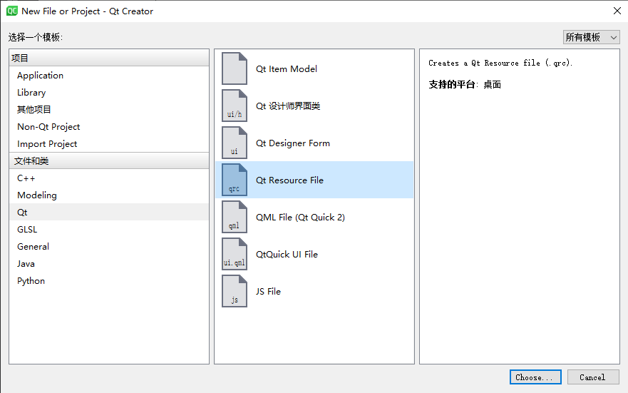
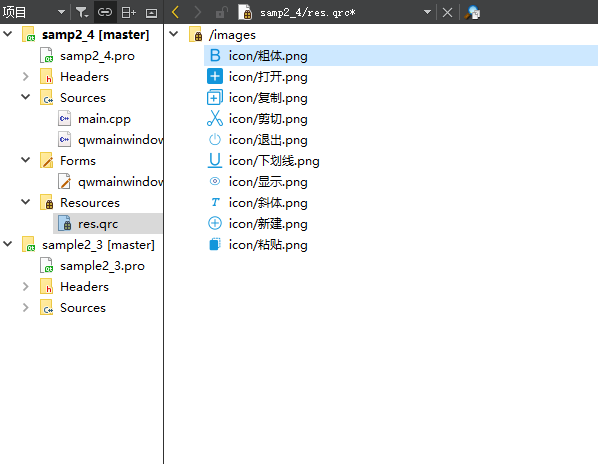
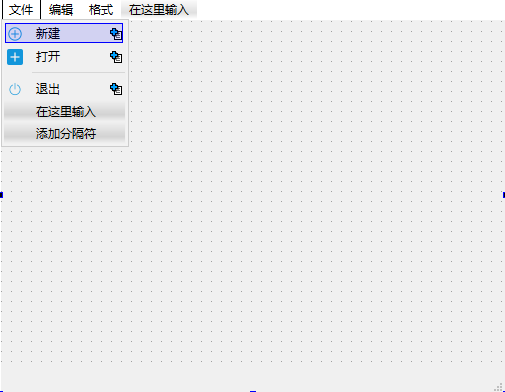

# 目录

## 混合方式UI设计

### 目的

原则：**能用可视化设计的就尽可能用可视化设计解决，无法解决的再用纯代码方式，将两种方法结合，才是高效设计UI的方法。**

类型|名称
---|---
基类|QMainWindow
类|QWMainWindow

QMainWindow:具有菜单栏、工具栏和状态栏。

### 添加资源文件





### 设计菜单和工具栏



- 工具栏
工具栏的toolButtonStyle属性需要注意：

名称|作用
---|---
Qt::ToolButtonTextBesideIcon|文字显示在按钮旁边
Qt::ToolButtonTextOnly|只显示文字
Qt::ToolButtonTextUnderIcon|文字显示在按钮下方

```c++
class Ui_QWMainWindow
{
public:
    QAction *actionnew;
    QAction *actionopen;
    QAction *actionexit;
    QAction *actioncut;
    QAction *actioncopy;
    QAction *actionpaste;
    QAction *actionclear;
    QAction *actionbold;
    QAction *actionItalic;
    QAction *actionUnderLine;
    QAction *actionLabel;
    QWidget *centralwidget;
    QMenuBar *menubar;
    QMenu *menu;
    QMenu *menu_2;
    QMenu *menu_3;
    QStatusBar *statusbar;
    QToolBar *toolBar;

    void setupUi(QMainWindow *QWMainWindow)
    {
        //设置主窗口名称，创建action，设置action名称与图标
        if (QWMainWindow->objectName().isEmpty())
            QWMainWindow->setObjectName(QString::fromUtf8("QWMainWindow"));
        QWMainWindow->resize(934, 379);
        actionnew = new QAction(QWMainWindow);
        actionnew->setObjectName(QString::fromUtf8("actionnew"));
        QIcon icon;
        icon.addFile(QString::fromUtf8(":/icon/new.png"), QSize(), QIcon::Normal, QIcon::Off);
        actionnew->setIcon(icon);
        actionopen = new QAction(QWMainWindow);
        actionopen->setObjectName(QString::fromUtf8("actionopen"));
        QIcon icon1;
        icon1.addFile(QString::fromUtf8(":/icon/open.png"), QSize(), QIcon::Normal, QIcon::Off);
        actionopen->setIcon(icon1);
        actionexit = new QAction(QWMainWindow);
        actionexit->setObjectName(QString::fromUtf8("actionexit"));
        QIcon icon2;
        icon2.addFile(QString::fromUtf8(":/icon/exit.png"), QSize(), QIcon::Normal, QIcon::Off);
        actionexit->setIcon(icon2);
        actioncut = new QAction(QWMainWindow);
        actioncut->setObjectName(QString::fromUtf8("actioncut"));
        QIcon icon3;
        icon3.addFile(QString::fromUtf8(":/icon/cut.png"), QSize(), QIcon::Normal, QIcon::Off);
        actioncut->setIcon(icon3);
        actioncopy = new QAction(QWMainWindow);
        actioncopy->setObjectName(QString::fromUtf8("actioncopy"));
        QIcon icon4;
        icon4.addFile(QString::fromUtf8(":/icon/copy.png"), QSize(), QIcon::Normal, QIcon::Off);
        actioncopy->setIcon(icon4);
        actionpaste = new QAction(QWMainWindow);
        actionpaste->setObjectName(QString::fromUtf8("actionpaste"));
        QIcon icon5;
        icon5.addFile(QString::fromUtf8(":/icon/paste.png"), QSize(), QIcon::Normal, QIcon::Off);
        actionpaste->setIcon(icon5);
        actionclear = new QAction(QWMainWindow);
        actionclear->setObjectName(QString::fromUtf8("actionclear"));
        QIcon icon6;
        icon6.addFile(QString::fromUtf8(":/icon/clear.png"), QSize(), QIcon::Normal, QIcon::Off);
        actionclear->setIcon(icon6);
        actionbold = new QAction(QWMainWindow);
        actionbold->setObjectName(QString::fromUtf8("actionbold"));
        QIcon icon7;
        icon7.addFile(QString::fromUtf8(":/icon/bold.png"), QSize(), QIcon::Normal, QIcon::Off);
        actionbold->setIcon(icon7);
        actionItalic = new QAction(QWMainWindow);
        actionItalic->setObjectName(QString::fromUtf8("actionItalic"));
        QIcon icon8;
        icon8.addFile(QString::fromUtf8(":/icon/italic.png"), QSize(), QIcon::Normal, QIcon::Off);
        actionItalic->setIcon(icon8);
        actionUnderLine = new QAction(QWMainWindow);
        actionUnderLine->setObjectName(QString::fromUtf8("actionUnderLine"));
        QIcon icon9;
        icon9.addFile(QString::fromUtf8(":/icon/underline.png"), QSize(), QIcon::Normal, QIcon::Off);
        actionUnderLine->setIcon(icon9);
        actionLabel = new QAction(QWMainWindow);
        actionLabel->setObjectName(QString::fromUtf8("actionLabel"));
        actionLabel->setCheckable(true);
        QIcon icon10;
        icon10.addFile(QString::fromUtf8(":/icon/show.png"), QSize(), QIcon::Normal, QIcon::Off);
        actionLabel->setIcon(icon10);
        centralwidget = new QWidget(QWMainWindow);
        centralwidget->setObjectName(QString::fromUtf8("centralwidget"));
        QWMainWindow->setCentralWidget(centralwidget);
        //创建菜单栏，创建菜单
        menubar = new QMenuBar(QWMainWindow);
        menubar->setObjectName(QString::fromUtf8("menubar"));
        menubar->setGeometry(QRect(0, 0, 934, 23));
        menu = new QMenu(menubar);
        menu->setObjectName(QString::fromUtf8("menu"));
        menu_2 = new QMenu(menubar);
        menu_2->setObjectName(QString::fromUtf8("menu_2"));
        menu_3 = new QMenu(menubar);
        menu_3->setObjectName(QString::fromUtf8("menu_3"));
        QWMainWindow->setMenuBar(menubar);
        //创建状态栏
        statusbar = new QStatusBar(QWMainWindow);
        statusbar->setObjectName(QString::fromUtf8("statusbar"));
        QWMainWindow->setStatusBar(statusbar);
        //创建工具栏
        toolBar = new QToolBar(QWMainWindow);
        toolBar->setObjectName(QString::fromUtf8("toolBar"));
        toolBar->setToolButtonStyle(Qt::ToolButtonTextBesideIcon);
        QWMainWindow->addToolBar(Qt::TopToolBarArea, toolBar);

        //向菜单栏里添加action
        menubar->addAction(menu->menuAction());
        menubar->addAction(menu_2->menuAction());
        menubar->addAction(menu_3->menuAction());
        menu->addAction(actionnew);
        menu->addAction(actionopen);
        menu->addSeparator();
        menu->addAction(actionexit);
        menu_2->addAction(actioncut);
        menu_2->addAction(actioncopy);
        menu_2->addAction(actionpaste);
        menu_2->addSeparator();
        menu_2->addAction(actionclear);
        menu_3->addAction(actionbold);
        menu_3->addAction(actionItalic);
        menu_3->addAction(actionUnderLine);
        menu_3->addSeparator();
        menu_3->addAction(actionLabel);
        //向工具栏中添加action
        toolBar->addAction(actionnew);
        toolBar->addAction(actionopen);
        toolBar->addAction(actionexit);
        toolBar->addSeparator();
        toolBar->addAction(actioncut);
        toolBar->addAction(actioncopy);
        toolBar->addAction(actionpaste);
        toolBar->addAction(actionclear);
        toolBar->addSeparator();
        toolBar->addAction(actionbold);
        toolBar->addAction(actionItalic);
        toolBar->addAction(actionUnderLine);
        toolBar->addAction(actionLabel);

        retranslateUi(QWMainWindow);

        QMetaObject::connectSlotsByName(QWMainWindow);
    } // setupUi
};
```

ui_qwmainwind.h中定义了类Ui_QWMainWind。
部分|功能
---|---
public|定义了界面所有的action和各种组件的指针
setupUi()|创建所有的Action和界面组件，而后将Action添加到主菜单和工具栏上

查看ui_qwmainwind.h李的代码有助于了解Action、菜单、工具栏的代码实现原理。

### 代码创建其他界面组件

增加一个SpinBox用来调整字体大小，一个FontComboBox来选择字体。
然而，当从组件面板里拖放一个SpinBox到工具栏上时，却发现工具栏“拒收”

为此需要编写一些代码来实现这些无法可视化设计的界面功能。

**灵光：重新分析 Ui ui QWMainWindow**

```c++
//qwmainwindow.h
namespace Ui { class QWMainWindow; }    //Ui命名空间里声明了QWMainWindow类
class QWMainWindow : public QMainWindow
{
    Q_OBJECT
public:
    QWMainWindow(QWidget *parent = nullptr);
    ~QWMainWindow();
private:
    Ui::QWMainWindow *ui;               //声明指向QWMainWindow类的指针 ui 
                                        //后在QWMainWindow的构造函数中调用ui->setup()
};

//ui_qwmainwindow.h
class Ui_QWMainWindow
{
public:
    //定义窗体所有组件\Action的指针

    void setupUi(QMainWindow *QWMainWindow)
    {
        //创建程序的整个布局

        retranslateUi(QWMainWindow);

        QMetaObject::connectSlotsByName(QWMainWindow);
    } // setupUi

    void retranslateUi(QMainWindow *QWMainWindow)
    {

    } // retranslateUi

};

namespace Ui {
    class QWMainWindow: public Ui_QWMainWindow {};  //ui命名空间里 QWMainWindow 继承了 Ui_QWMainWindow
} // namespace Ui

```

### Action的功能实现

**Action是一种不可见的界面元素，主要用于菜单项、工具栏按钮的设计。Action的主要信号时trigger()，为一个Action的trigger()信号编写槽函数之后，菜单和工具栏上由此Action创建的菜单项和工具栏按钮就都关联此槽函数。**

- 编辑功能Action的实现
QTextEdit类有剪切、复制、粘贴和清除的功能，无需再编写冗余的代码，直接将trigger()与txtEdit相应的槽函数进行关联即可。
- 其他Action的功能实现

```c++
//actionBold槽函数-设置TXTEdit为粗体
void QWMainWindow::on_actionbold_triggered(bool checked)
{
    QTextCharFormat fmt;
    fmt=ui->txtEdit->currentCharFormat();
    if(checked)
        fmt.setFontWeight(QFont::Bold);
    else
        fmt.setFontWeight(QFont::Normal);
    ui->txtEdit->mergeCurrentCharFormat(fmt);
}
//actionItalic槽函数-设置TXTEdit为斜体
void QWMainWindow::on_actionItalic_triggered(bool checked)
{
    QTextCharFormat fmt;
    fmt=ui->txtEdit->currentCharFormat();
    if(checked)
        fmt.setFontWeight(QFont::StyleItalic);
    else
        fmt.setFontWeight(QFont::Normal);
    ui->txtEdit->mergeCurrentCharFormat(fmt);
}
//actionUnderline槽函数-设置TXTEdit为下划线
void QWMainWindow::on_actionUnderLine_triggered(bool checked)
{
    QTextCharFormat fmt;
    fmt=ui->txtEdit->currentCharFormat();
    if(checked)
        fmt.setUnderlineStyle(QTextCharFormat::SingleUnderline);
    else
        fmt.setUnderlineStyle(QTextCharFormat::NoUnderline);
}
```

- Action的enabled和checked属性的更新
为了使界面和程序功能更加智能一点，应该根据当前的状态自动更新相关Action的checked和enabled属性。

action|功能
---|---
剪切复制粘贴|enabled
粗体斜体下划线|checked

编辑txtEdit的slot：

- copyAvailable(bool)信号在有内容可以被复制时发射，传递一个bool参数，用来改变actCut/actCopy的enable属性
- selectionChanged()信号在**选择的文字发生变化**时发射，利用此信号可以读取当前文字的格式，从而更新粗体、斜体和下划线3中字体设置Action的checked属性。

### **手工创建的组件**的信号与槽

由于手工创建的组件不可以进行可视化编辑，所以要采用手工创建槽函数并关联它们。

槽函数：
```c++
//qwmainwindow.cpp
void QWMainWindow::on_spinFontSize_valueChanged(int aFontSize)
{
    QTextCharFormat fmt;
    fmt.setFontPointSize(aFontSize);            //设置字体大小
    ui->txtEdit->mergeCurrentCharFormat(fmt);   //融合字体设置到txtEdit
    progressBar1->setValue(aFontSize);
}

void QWMainWindow::on_comboFont_currentIndexChanged(const QString &arg1)
{
    QTextCharFormat fmt;
    fmt.setFontFamily(arg1);                    //设置字体
    ui->txtEdit->mergeCurrentCharFormat(fmt);   //融合字体设置到txtEdit
}
```

