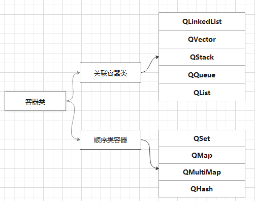

<!-- TOC -->

- [1. 容器类](#1-容器类)
  - [1.1. 容器类概述](#11-容器类概述)
  - [1.2. 顺序容器类](#12-顺序容器类)
    - [1.2.1. QList](#121-qlist)
    - [1.2.2. QLinkedList](#122-qlinkedlist)
    - [1.2.3. QVector](#123-qvector)
    - [1.2.4. QStack](#124-qstack)
    - [1.2.5. QQueue](#125-qqueue)
  - [1.3. 关联容器类](#13-关联容器类)
    - [1.3.1. QSet](#131-qset)
    - [1.3.2. QMap](#132-qmap)
    - [1.3.3. QMultiMap](#133-qmultimap)
    - [1.3.4. QHash](#134-qhash)

<!-- /TOC -->
# 1. 容器类

## 1.1. 容器类概述

Qt容器类相较于STL中的容器：

- Qt隐式共享和可重入的
- 速度和储存优化
- 线程安全，作为只读容器时可被多个线程访问

容器类是基于模板的类，如常用的容器类`QList<T>`：
T是一个具体的类型，可以是int、float等简单类型，也可以是Qstring、QDate等类，**但不能是QObject或任何其子类**。
T必须是一个可赋值的类型，即T必须提供一个缺省的构造函数，一个拷贝构造函数和一个赋值运算符。
> 拷贝构造函数是一种特殊的构造函数，它在创建对象时，是使用同一类中之前创建的对象来初始化新创建的对象。



```c++
class Line
{
   public:
      int getLength( void );
      Line( int len );             // 简单的构造函数
      Line( const Line &obj);      // 拷贝构造函数
      ~Line();                     // 析构函数
   private:
      int *ptr;
};
// 成员函数定义，包括构造函数
Line::Line(int len)
{
    cout << "调用构造函数" << endl;
    // 为指针分配内存
    ptr = new int;
    *ptr = len;
}
Line::Line(const Line &obj)
{
    cout << "调用拷贝构造函数并为指针 ptr 分配内存" << endl;
    ptr = new int;
    *ptr = *obj.ptr; // 拷贝值
}
```

Qt的容器类分为**顺序容器**和**关联容器**
容器迭代类用于遍历容器里的数据项，有**Java类型的迭代类**和**STL类型的迭代类**。Java类型的迭代类易于使用，提供高级功能，而STL类型的迭代类效率更高一些。

## 1.2. 顺序容器类

有QList、QLinkedList、QVector、QStack和QQueue

### 1.2.1. QList

QList 是最常用的容器类，以数组列表的形式实现的，但是在其前或后添加数据非常快，QList以下索引的方式对数据进行访问。
QList的方法：
方法名|作用
---|---
insert()|添加
replace()|替换
**removeAt()**|移动到
move()|移动
swap()|交换
append()|添加
**prepend()**|Inserts value at the beginning of the list.
removeFirst|移动到首部
removeLast|移动到尾部
QList提供下表索引访问数据项，**也提供at()函数**

### 1.2.2. QLinkedList

链式链表，数据项不是用连续的内存储存的，它基于迭代器访问数据项，并且插入和删除数据项的操作时间相同

除了不提供基于下表索引的数据项访问外，QLinkedLIst的其他接口函数与QList基本相同。

### 1.2.3. QVector

`QVector<T>`提供动态数组的功能，以下标索引访问数据。

### 1.2.4. QStack

`QStack<T>`提供类似于堆栈的**后入先出**操作的容器类，push()和pop()是主要的接口函数。

```c++
QStack<int> stack;
stack.push(10);
stack.push(20);
stack.push(30);
while(!stack.isEmpty())
    cout<<stack.pop()<<endl;
```

程序会依次输出30，20，10

### 1.2.5. QQueue

`QQueue<T>`类似于队列的先入先出(FIFO)操作的容器类。enqueue()和dequeue()是主要的操作函数。
例如：

```c++
QQueue<int> queue;
queue.enqueue(10);
queue.enqueue(20);
queue.enqueue(30);
while(!queue.isEmpty())
    cout<<queue.dequeue()<<endl;
```

程序会依次输出10，20，30

## 1.3. 关联容器类

QMap QMultiMap QHash QMultiHash QSet

### 1.3.1. QSet

QSet是基于散列表的集合模板类，它储存数据的顺序是不定的，查找值的速度非常快。
`QSet<T>`内部是用QHash实现的。
定义`QSet<T>`和输入数据的实例代码：

```c++
QSet<QString> set;
set << "Halo" <<"Toto";
```

测试一个值是否包含于这个集合，用contains()函数，示例如下：

```c++
if(!set.contains("Toto"))
    ...
```

### 1.3.2. QMap

`QMap<Key,T>`提供一个字典，一个键映射到一个值。QMap储存数据是安装键值的顺序。
定义`QMap<QString,int>`类型变量和赋值的实例代码如下：

```c++
QMap<QString,int> map;
map["one"]=3;
map["two"]=2;
map["three"]=7;
```

也可以使用insert()函数赋值，或remove()移除一个键值对，示例如下：

```c++
map.insert("four",4);
map.remove("two");
```

查值：

```c++
int num1 = map["one"];
int num2 = map.value("two");
```

### 1.3.3. QMultiMap

它是QMap的子类，是用于处理多值映射的便利类。
多值映射就是一个键可以对应多个值。

```c++
QMultiMap<QString,int> map1, map2, map3;
map1.insert("Toto", 3);
map1.insert("Toto", 2);
map2.insert("Toto", 7);
map3 = map1 + map2;
```

**QMultiMap不提供[]操作符，使用value()函数访问最新插入的键的单个值**，若要获取多个值可以使用`values()`函数，返回值是`QList<T>`类型。

```c++
QList<int> values = map.values("plenty");
for(int i = 0;i< values.size(); ++i)
    cout << values.ai(i) <<endl;
```

### 1.3.4. QHash

QHash是基于散列表来实现**字典**功能的模板类，`QHash<Key,T>`储存的键值对具有非常快的查找速度。
QHash 和 QMap的区别：

对比|QHash|QMap
---|---|---
查找速度|快|慢
遍历顺序|任意顺序|按照键排序
运算符|必须提供"<"|必须提供`==`和一个名称为qHash()的全局散列函数
